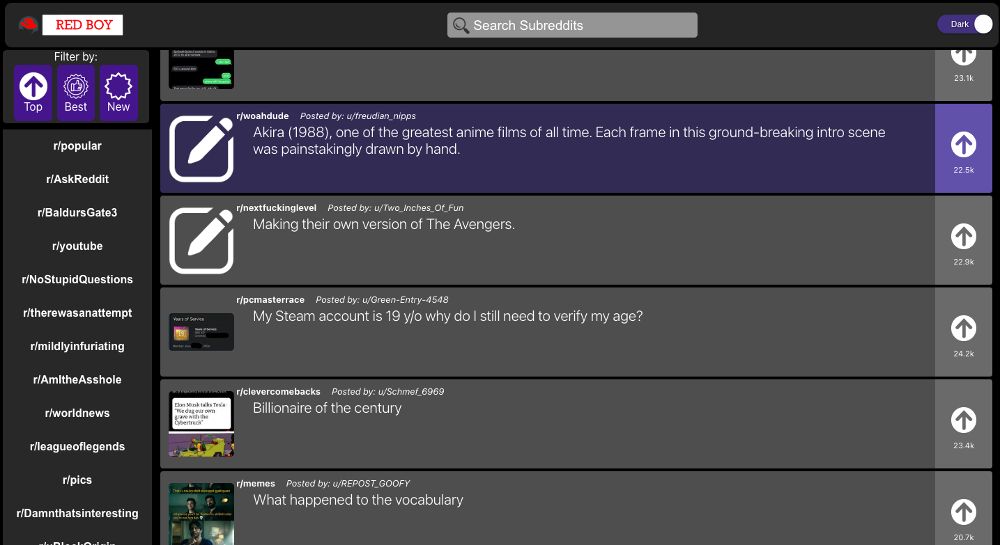

# Reddit Client App - RedBoy

Welcome to my Reddit Client App, RedBoy! This web application allows users to explore Reddit posts and comments, built with React and Redux.



## Features

- View Reddit posts and comments.
- Search for specific content.
- Filter posts by predefined categories.
- Detailed view for selected posts.

## Technologies Used

- **React**: Used for building the user interface.
- **Redux**: Implemented for state management.
- **Jest and Enzyme**: Used for unit testing.
- **GitHub**: Version control and hosting.
- **CSS**: Styling the application.
- **Reddit API**: Data source for Reddit content.

## Getting Started

Follow these steps to get the Reddit Client App up and running on your local machine:

1. Clone this repository to your local machine:

   ```bash
   git clone https://github.com/shafihi/RedBoy
   ```

2. Install project dependencies:

   ```bash
   npm install
   ```

3. Start the development server:

   ```bash
   npm start
   ```

4. Open your web browser and visit `http://localhost:3000` to access the Reddit Client App.

## Testing

To run unit tests, use the following command:

```bash
npm test
```

For end-to-end tests, use:

```bash
npm run e2e-test
```

## Deployment

To deploy the Reddit Client App, follow these steps:

1. Host your code on a platform like GitHub.
2. Set up a CI/CD workflow for automatic deployment (if applicable).
3. Optionally, acquire a custom domain name.
4. Ensure your application meets the criteria for being a progressive web app (PWA) if you choose to make it one.

## Contributing

Contributions to this project are welcome. If you'd like to contribute, please follow our [Contribution Guidelines](CONTRIBUTING.md).

## License

This project is licensed under the [MIT License](LICENSE.md).

Thank you for using the Reddit Client App. If you have any questions or need assistance, feel free to contact [Kasimu Ozeto](mailto:shafihikasim@yahoo.com). Enjoy exploring Reddit with the app! 🚀
```

